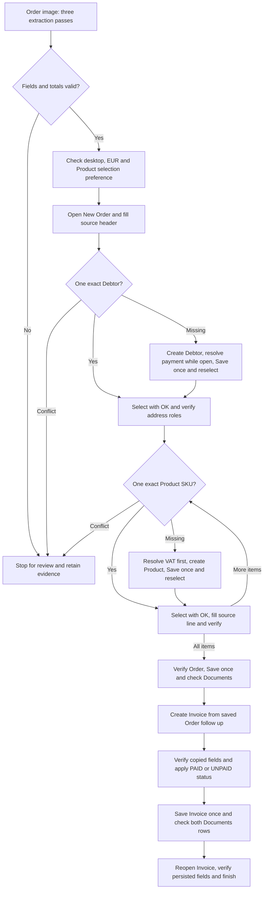

# Fakturama Image to Cash

Turn one order image into a saved Order and linked Invoice in Fakturama, including source payment status and final verification. The implementation uses Python, Windows OCR, an Ollama-compatible vision model, and Microsoft UI Automation.

Supported setup: **Windows, English Fakturama 2.2.0, EUR, and the supplied image layout**. Development takes place on the **Development** branch.

## Current status

The latest image transaction saved **PO000011 → INV000005**, total **EUR 678.30**, paid by Bank Transfer on 18 July 2026. Final Invoice reopening initially stopped on a table-layout check. After correcting that mapping, the existing saved Invoice passed a separate read-only verification. A fresh uninterrupted run after that correction remains to be checked.

The latest automated suite passed **414 tests**. See [verification](documents/implementation/verification.md) for observed results and [remaining work](documents/implementation/remaining-issues-and-test-plan.md) for limits.

## Set up and run

Follow [the CMD setup guide](code/README.md). It includes the **CPU-only workaround** for the local GPU vision error and [step-by-step new-device calibration](documents/implementation/calibration.md).

The example input is included at [documents/Live_Task.png](documents/Live_Task.png). You can supply another readable raster image with the supported layout. Each `run` creates a **new Order**; inspect saved identifiers after a failure before rerunning.

## Current workflow



Any failed check or uncertain action stops for review. The Order stays open while missing masters are resolved. Proposed Order/Customer/Invoice identifiers and proposed Invoice dates are preserved. Invoice and Delivery postal fields are checked separately. The flow ends after Invoice verification.

## Code structure and boundaries

```text
code/
  pyproject.toml                 Dependencies and CLI entry point
  src/fakturama_cash/
    cli.py                      Commands and result reporting
    extraction.py               OCR-assisted vision extraction
    models.py, normalize.py     Schema, dates and Decimal arithmetic
    matching.py, verification.py Exact identity and observed-value checks
    workflow.py                 Order-first business sequence
    ui.py                       UIA actions and observations
    clipboard_table.py          Custom table reads and row checks
    item_table.py               Calibrated item-cell editing
    calibration*.py             Guided device measurements
    state.py                    Run lock, checkpoints and events
  config/                       UI control and table mappings
  scripts/                      Profile builder and developer smoke runner
  tests/                        Synthetic data and simulated UI checks
documents/implementation/       Setup details, coverage and verification
```

`cli.py` starts extraction and validation, then passes the validated input to `workflow.py`. The workflow owns matching and business decisions; `ui.py` executes mapped actions and returns observed values. `state.py` records intent before writes. Configuration contains control paths and measured table geometry, while calibration produces a device-local profile.

The program changes Fakturama through its UI only. Tests use simulated controls. Checkpoints support review, not automatic resume; uncertain Save/payment actions are not replayed. Other image layouts, currencies, UI languages, nonzero document discount/shipping, and uncalibrated grid scrolling need more work.

Run evidence, local calibration profiles, and Word design files stay outside Git. The sample order image is included.
