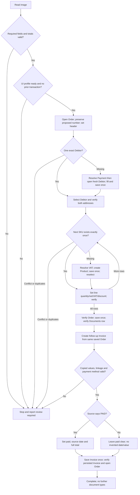

# Fakturama Image-to-Cash

A guarded Python prototype for reading an order image and creating an Order followed by its linked Invoice through Fakturama's Windows UI.

**Status: not yet a working live end-to-end automation.** The business workflow and safety checks are implemented and tested with a fake UI. Live accessibility discovery and raw Windows OCR succeeded. Local `gemma3:4b` is available. Image validation now uses cropped-table and non-item extraction passes; the live UI profile remains incomplete. `run` deliberately stops rather than using guessed selectors or business values.

The existing Part 1 Word design documents are preserved unchanged. The assignment remains the authoritative specification; the deviations and unfinished work below must be disclosed with this submission.

## Setup

Use Windows with Python 3.11+, an unlocked interactive desktop, and Fakturama running at the same privilege level as Python. Use a disposable Fakturama workspace for calibration. Back up its data first; do not use customer production data.

CMD, from the `code` directory. The shared virtual environment remains one level above it:

```bat
py -3 -m venv ..\.venv
..\.venv\Scripts\python.exe -m pip install -e ".[test,ocr]"
..\.venv\Scripts\python.exe -m pytest -q
..\.venv\Scripts\fakturama-cash.exe --help
```

The `ocr` extra and Windows' installed English OCR language pack are required for image extraction: OCR locates the table boundaries. OCR does not supply business values. The standalone `ocr` command remains a raw diagnostic. The dependency configuration is in `pyproject.toml`; the environment used for testing is recorded in [verification notes](../documents/implementation/verification.md).

## Commands

No activation is required when using these explicit executable paths.

On this workspace, the existing system pytest temporary directory is owned by a different execution account. If plain `pytest` reports access denied during fixture setup, use a fresh local test directory:

```bat
if not exist .pytest_runs mkdir .pytest_runs
set "PYTEST_DEBUG_TEMPROOT=%CD%\.pytest_runs"
..\.venv\Scripts\python.exe -m pytest -q
```

```bat
REM Validate a clearly labeled synthetic fixture; no extraction and no UI writes.
..\.venv\Scripts\fakturama-cash.exe validate-json tests/fixtures/synthetic_order.json

REM Capture the live window's accessibility tree and screenshot; read-only.
..\.venv\Scripts\fakturama-cash.exe diagnose --out evidence/private/diagnostics

REM Raw OCR text and word bounds. NOT structured/validated extraction.
..\.venv\Scripts\fakturama-cash.exe ocr "C:\path\order.png" --out evidence/private/ocr

REM List missing mappings without connecting to the desktop.
..\.venv\Scripts\fakturama-cash.exe check-profile config/observed.partial.json
```

### Image extraction and validation

The structured extraction path makes two sequential requests to an **Ollama-compatible `/api/chat` vision endpoint**:

1. Windows OCR locates the ITEMS section, all eight column headings and NET TOTAL. The original-resolution table crop is sent with an item-only schema.
2. The full image is sent with a non-item schema for customer, addresses, payment, order header and printed document totals.
3. Both validated sections are combined and the existing line/VAT/document arithmetic checks run unchanged.

Each pass preserves its raw response. Unclear boundaries, model uncertainty, invalid fields or mismatched arithmetic stop the run; there is no fallback to the old full-page item extraction. No synthetic fixture or manually corrected values enter the runtime data. This supports the assignment's single-table layout, not arbitrary invoices.

Configure a vision-capable model installed on your service:

```bat
set "FAKTURAMA_VISION_URL=http://localhost:11434/api/chat"
set "FAKTURAMA_VISION_MODEL=gemma3:4b"
..\.venv\Scripts\fakturama-cash.exe validate "C:\path\order.png"
```

Set these variables in the same CMD session as the command; activating `.venv` does not set them. The two model requests can take several minutes each on CPU, with a 1200-second socket timeout per request. Schema/arithmetic validation cannot prove that names and addresses match the source; inspect the private evidence before using the prototype. `.env.example` documents the variables; the CLI does **not** automatically load `.env`. An optional `FAKTURAMA_VISION_TOKEN` is supplied in the Authorization header, not logged. A remote endpoint receives the entire image; use only an approved service, with HTTPS and appropriate data permission.

The document's full-page **Sales Order Input** image was available and inspected. Its smaller Fakturama screenshots are UI references, not runtime inputs. Raw OCR of the full-page image was attempted; its SKU/percentage errors were not manually patched into runtime data.

### Full workflow — blocked until calibration is complete

```bat
..\.venv\Scripts\fakturama-cash.exe check-profile config/live.json
..\.venv\Scripts\fakturama-cash.exe run "C:\path\order.png" --profile config/live.json
```

`config/live.json` is intentionally not supplied. Do not make the partial profile runnable merely by changing `calibrated` to true. Complete and verify all action/query mappings first; see [UI calibration](../documents/implementation/ui-profile.md).

Exit code 0 means the command's reported operation completed; 2 means review is required. A successful `diagnose`, raw `ocr`, or synthetic validation is **not** a successful Order/Invoice run. Only `run` can report `complete`, after persisted-state verification.

### Terminal progress (CMD)

Progress is enabled by default. Each stage prints immediately with elapsed time;
while a stage is waiting, a heartbeat appears every 10 seconds. Workflow runs also
report UI actions, observations, item counts and verified milestones. These are
activity messages, **not** a percentage or confirmation that the model's answer is correct.
Progress uses stderr; the final success JSON remains on stdout. Failure ends with
a STOPPED message and the existing error JSON on stderr. No customer fields,
model response text or authorization tokens are included in progress messages.

```cmd
cd /d "D:\TJM Task\code"
set "FAKTURAMA_VISION_URL=http://localhost:11434/api/chat"
set "FAKTURAMA_VISION_MODEL=gemma3:4b"
..\.venv\Scripts\fakturama-cash.exe validate "..\documents\qa_flow_source\source_unpacked\word\media\image9.png"
```

Add `--quiet` before or after the subcommand to suppress progress and retain the
previous result/error output format. To keep progress visible while saving the
final success result in CMD, use `> result.json`; `2> progress.log` also captures
progress and any error JSON. Existing error details can contain source values, so
treat failure logs as private. Progress does not extend the 1200-second per-request extraction
socket timeout, retry model/UI actions, fix extraction accuracy, or enable missing
UI mappings.

## How the implementation is organized

| Location | Responsibility |
|---|---|
| `extraction.py`, `table_crop.py`, `windows_ocr.py` | Two-pass vision extraction; OCR-anchored, original-resolution table crop |
| `models.py`, `normalize.py` | Strict schema, required fields, Decimal/date parsing and reconciliation |
| `matching.py`, `verification.py` | Exact master-data matching and expected-versus-observed checks |
| `ui.py`, `config/` | Scoped UIA discovery, bounded observations, profile-driven actions and evidence |
| `workflow.py` | Order-first sequence, missing masters, linked Invoice and final checks |
| `state.py` | Input hashes, write-ahead checkpoints, exclusive run lock and JSONL events |
| `cli.py` | Commands and structured review-required errors |
| `tests/` | Synthetic fixtures and explicitly simulated UI tests |

Comments explain non-obvious safety decisions rather than narrating every line.

## Workflow and manual intervention



Any uncertain mutation or failed verification also goes to **Stop and report review required**. There is no unattended wait for a human and no automatic resume: the process exits with stage, reason, available expected/observed values, evidence location and a safe next action. Successful observations may be retried; saves, creation, and item insertion are not blindly repeated.

### Deliberate decisions and limits

- **Payment dropdown refresh:** the user observed that an already-open Debtor did not see a newly saved payment method until reopened. For a missing Debtor, this implementation resolves payment first, then opens a fresh Debtor while retaining the Order. This is an explicit sequencing deviation from the brief's keep-Debtor-open instruction. No unsaved Debtor is closed or discarded. The workaround is mocked, not live-verified.
- **Money:** Decimal throughout; line net and Product gross round half-up to two decimals. VAT is rounded per VAT-rate subtotal. Source totals must match exactly, and the UI must independently match before saving. This policy has not yet been verified against Fakturama for mixed-rate/fractional edge cases.
- **Input scope:** EUR only. Ambiguous three-digit decimal/grouping strings and numeric floats are rejected. PAID requires a source date; missing payment status is not treated as unpaid. Nonzero overall discount/shipping stop until their tax treatment is implemented. Unsupported payment mappings stop when creation is needed.
- **Identity:** company, first name, last name, ZIP and city must match a single Debtor result; SKU identifies a Product. Payment terms and VAT definitions are checked for conflicts. Matching ignores whitespace/case, not punctuation. Existing product prices are not silently trusted: the transaction line is set and checked against the image.
- **Reruns:** both image and normalized-input fingerprints are checked. Persisted same-company/reference candidates stop even if the date or total differs. Reference alone is not treated as globally unique. This conservative rule can require review for legitimate repeated references.
- **UI:** no fixed screen coordinates. Dynamic bounds clicks are supported only for uniquely discovered UIA controls. OCR-based custom-grid reading/clicking, robust popup selection, and separate delivery-address calibration remain unfinished. The complete live workflow is consequently unavailable.

## Evidence and recovery

Run artifacts are private and ignored by Git:

- `runs/<image-sha256>/extractions/<attempt-id>/`: `table/` contains OCR, crop, request, raw response and normalized items; `fields/` contains the non-item request/response. Top-level `normalized.json` is the combined order (saved before reconciliation), not proof of success. Failure reports remain at the attempt root.
- `runs/<image-sha256>/checkpoint.json`: write intentions/outcomes, verified stage and known document identifiers.
- `runs/<image-sha256>/events.jsonl`: timestamped workflow events; screenshots/UIA trees at important transitions and failures.
- `evidence/private/diagnostics/`: actual read-only Fakturama capture, not a successful business execution.
- `evidence/private/source-ocr/`: actual raw OCR observations of the supplied image.

After a timeout, do not rerun, delete the checkpoint, or repeat Save. Inspect Fakturama's Documents list, the known numbers, source company/reference/date/total and linked documents. With a calibrated profile, this command is read-only:

```bat
..\.venv\Scripts\fakturama-cash.exe reconcile "runs\<hash>\checkpoint.json" --profile config/live.json
```

It prints matching persisted identifiers for human inspection; it does not prove all fields or resume work. If no identifier was recorded, search manually by source details. Only remove a stale `.active-run.lock` after confirming its process ended and reconciling unfinished writes. Use one process and one run directory per Fakturama workspace; cross-directory/multi-machine locking is not implemented.

See [requirement coverage](../documents/implementation/requirements.md) and [actual verification/evidence notes](../documents/implementation/verification.md). Review private screenshots before sharing: they may contain customer data. Git ignores are not a substitute for checking staged files.

## If I had 3 more hours

1. **90 minutes:** finish the existing-master live path in a disposable workspace, especially complete result-grid enumeration, fresh visual grounding, editor scoping and separate delivery addresses. Verify Order-to-Invoice linkage and persisted payment fields.
2. **45 minutes:** evaluate the integrated two-pass extractor field-by-field on more images, especially addresses and unclear text. Keep uncertainty a review condition.
3. **45 minutes:** run missing-payment/VAT/Product/Debtor and interrupted-save cases live; capture a short annotated demonstration and revise this checklist to reflect only observed results.

These are priorities, not a promise that all integration gaps fit within three hours. Reliable live execution comes before adding more features.
