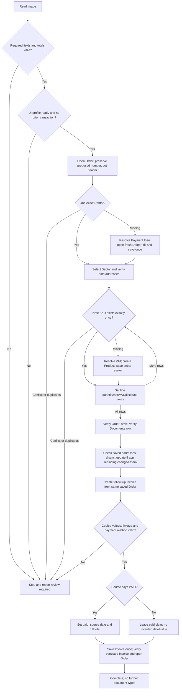

# Fakturama Image-to-Cash

A guarded Python prototype for reading an order image and creating an Order followed by its linked Invoice through Fakturama's Windows UI.

**Status (2026-10-04, Development):** remaining UIA implementation is complete
for the supported English/EUR assignment path. A clean production Workflow run
created PO000004 → INV000003 at EUR678.30 and verified both addresses, ordered
lines, preserved dates and paid fields after reopening the Invoice. The larger
four-line PO000003 → INV000002 also passed at EUR736.61 during development.
Image extraction passed separately; these UI runs began with synthetic JSON.
See [live integration evidence](../documents/implementation/live-integration-2026-10-04.md).

The existing Part 1 Word design documents are preserved unchanged. The assignment remains the authoritative specification; the deviations and unfinished work below must be disclosed with this submission.

The source image previously passed separate item, address and non-item extraction
with manual field review. The Python segmented date writer now works live.
The user authorized Germany/EUR and synthetic data in the test workspace, and the
old mixed-currency draft was discarded with explicit permission. Latest regression
suite: **286 passed**. Private live evidence stays outside Git.

## Setup

The adapter reads SWT grids through UIA focus and Copy. Product results have six
raw TSV columns; debtor results have nine and need a bounded single-row walk.
Every selected row is checked before double-click activation. Definitions are
inspected in their editors because list columns omit important fields. Documents
reads explicitly select Orders and Invoices; reopening the view retains filters.
Workflow preflight rejects dirty editors and an uncalibrated profile.

With the Products list open, inspect its copied data without activating a row or
saving (this replaces the system clipboard):

```bat
cd /d "D:\TJM Task\Implementation\TJM-Task\code"
..\.venv\Scripts\python.exe -m fakturama_cash.cli inspect-table product_list --profile config/table-copy.partial.json
```

This partial mapping deliberately uses `copy_scope: unverified`; it cannot be
used by the business workflow. See [UI profile details](../documents/implementation/ui-profile.md)
for the small new operations and the remaining calibration requirements.

Compose the local profile from the reviewed component mappings:

```bat
..\.venv\Scripts\python.exe scripts\build_live_profile.py
```

This defaults to `calibrated: false`. `--calibrated` confirms that the component
mappings have been checked in the target English/EUR test workspace; it does not
claim a successful integrated transaction. The generated `config/live-profile.json`
is ignored by Git. `scripts/run_live_smoke.py` runs a CODEX-labelled synthetic JSON
fixture through the same journal and workflow, without repeating image extraction.

All commands below are for **Windows CMD**, not PowerShell. Setup has three separate
parts: Python dependencies, OCR + a running vision model, and a calibrated Fakturama
UI. Installing Python packages alone does not provide the model or complete the UI mappings.

### 1. Prerequisites

| Requirement | Why it is needed |
| --- | --- |
| Windows 10 22H2 or newer / Windows 11 | Native Windows UI automation, Windows OCR and the local Ollama setup |
| Python 3.11+; this workspace uses 3.12 | Runs the CLI; use a Windows Python installation, not WSL |
| Fakturama installed and able to open a test workspace | Target desktop application; use the English UI observed by the current mappings |
| Windows English (`en-US`) OCR language support | The code explicitly requests this language; pip does not install Windows language capabilities |
| Ollama plus the downloaded **vision-capable** `gemma3:4b` model | Produces structured fields from the order image; a text-only model is insufficient |
| Original readable order image and writable local folders | Input plus private extraction, diagnostic and checkpoint evidence |
| Complete, live-verified UI profile | Generate and review `config/live-profile.json` from the supplied component mappings |

Use an unlocked interactive desktop, with Fakturama and Python at the same privilege
level. Back up Fakturama data and use a disposable workspace, not production data.
Ensure enough disk space for Python, Ollama, its model and private evidence, and
enough available memory to load the model. CPU inference can take several minutes
per pass; there is no guaranteed runtime on every machine.

### 2. Install the Python project

Open CMD in the checkout's `code` directory (adjust the path on another machine).
The shared virtual environment is one level above it. Create it only if it does
not already exist:

```bat
cd /d "D:\TJM Task\Implementation\TJM-Task\code"
py -3.12 --version
if not exist ..\.venv\Scripts\python.exe py -3.12 -m venv ..\.venv
..\.venv\Scripts\python.exe -m pip install -e ".[test,ocr]"
..\.venv\Scripts\python.exe -m pip check
..\.venv\Scripts\fakturama-cash.exe --help
```

Install Python first if `py` is unavailable; choose the version you installed if it
is not 3.12. Using the explicit executable paths means activation is unnecessary.
The `[test,ocr]` extras include pytest and the WinRT OCR bindings; core dependencies
include Pydantic, Pillow and pywinauto. They do **not** install Fakturama, Ollama,
model weights or the Windows OCR language capability.

### 3. Install Ollama and download the vision model

Install Ollama using the [official Windows installer](https://ollama.com/download/windows),
then open a **new CMD window**. If using VS Code's terminal, restart VS Code after
installation so it receives the updated PATH. Ollama runs a local API on port 11434;
see its [Windows setup requirements](https://docs.ollama.com/windows).

```bat
where ollama
ollama --version
ollama pull gemma3:4b
ollama ls
curl.exe --fail http://localhost:11434/api/tags
```

Confirm `gemma3:4b` appears in the installed model list and the API response.
Downloading requires internet access; subsequent local inference uses the installed
model. The [gemma3:4b model](https://ollama.com/library/gemma3:4b) accepts images and
requires Ollama 0.6 or later. Do not replace it with a text-only tag. Its listed
download is approximately 3.3 GB; download size is not a RAM requirement.

If the API connection fails, start the Ollama app. Alternatively, run the following
in a **separate CMD window** and keep that window open:

```bat
ollama serve
```

Do not start a second server when the background app already serves port 11434.
An address-already-in-use error means you should check the existing service, not
keep retrying. The project contacts the API directly; an interactive `ollama run`
chat and the Python `ollama` package are not needed. See the
[Ollama CLI reference](https://docs.ollama.com/cli).

### 4. Configure this CMD session

In the CMD window that will run the project:

```bat
cd /d "D:\TJM Task\Implementation\TJM-Task\code"
set "FAKTURAMA_VISION_URL=http://localhost:11434/api/chat"
set "FAKTURAMA_VISION_MODEL=gemma3:4b"
set FAKTURAMA_VISION_MODEL
```

Repeat these settings in every new terminal. Activating `.venv` does not restore
them, and copying `.env.example` to `.env` has no effect: the CLI does **not** load
`.env` automatically. No token is needed for the default local Ollama service.
An approved remote service may use `FAKTURAMA_VISION_TOKEN`; it receives the source
image, so use HTTPS and appropriate data permission. Keep secrets out of Git.

### 5. Check OCR, the source image and extraction

Install Windows English OCR language support if it is missing. The following
diagnostic is the practical check that the Python bindings and Windows OCR engine
both work. Use the full-page **Sales Order Input** image, not a small Fakturama UI
screenshot. Provide a readable raster image such as PNG; the CLI does not directly
extract images from DOCX/PDF or accept SVG. The input file must not exceed 20 MB
or Windows OCR's supported image dimensions.

The image path below exists in this working copy; private/extracted artifacts may
be absent in a clean clone. Supply your own extracted assignment image if needed:

```bat
set "ORDER_IMAGE=..\documents\qa_flow_source\source_unpacked\word\media\image9.png"
dir "%ORDER_IMAGE%"
..\.venv\Scripts\fakturama-cash.exe ocr "%ORDER_IMAGE%" --out evidence\private\setup-ocr
..\.venv\Scripts\fakturama-cash.exe validate "%ORDER_IMAGE%"
```

Stop if a check fails. `validate` must report `validated_image`; inspect its private
evidence against the original image before attempting business writes. OCR locates
the table and address blocks, supplies raw address hints and checks address/customer
ID consistency. It does not replace the vision extraction with approved order data.
The three model requests each have a 1200-second socket timeout. Passing raw OCR
alone does not prove the model works. Neither command needs Fakturama or changes it.

Run the automated tests separately; they do not download models or perform live UI
writes. This local temporary directory avoids this workspace's system-temp ownership issue:

```bat
if not exist .pytest_runs mkdir .pytest_runs
set "PYTEST_DEBUG_TEMPROOT=%CD%\.pytest_runs"
..\.venv\Scripts\python.exe -m pytest -q
```

### 6. Prepare Fakturama and pass the live-workflow gate

Open the backed-up, disposable workspace in Fakturama. Check that its currency is
**EUR**, matching the assignment, and use the English UI expected by the draft
selectors. Keep the desktop unlocked and avoid interacting with it during automation.
Review unrelated unsaved editors yourself; the automation must not discard them.
Use a writable `runs` directory and one automation process per Fakturama workspace.

First capture the UI and review that the screenshot actually shows Fakturama:

```bat
..\.venv\Scripts\fakturama-cash.exe diagnose --out evidence\private\setup-ui
..\.venv\Scripts\fakturama-cash.exe check-profile config\observed.partial.json
```

The partial-profile check is **expected to fail** with missing mappings. Follow
[UI calibration](../documents/implementation/ui-profile.md) and the
[Order-header checks](../documents/implementation/order-header-mapping.md) to verify
controls in small groups. Header success alone is not enough: Debtor/Product
selectors, complete result tables, addresses, payments/VAT, Order/Invoice fields,
linkage and persisted-state verification use the composed mappings described above.

Only after creating and live-verifying `config\live-profile.json`, run these commands in
the same CMD session configured above. Run the second only if the first succeeds:

```bat
..\.venv\Scripts\fakturama-cash.exe check-profile config\live-profile.json
..\.venv\Scripts\fakturama-cash.exe run "%ORDER_IMAGE%" --profile config\live-profile.json
```

`check-profile` checks configuration completeness, not live correctness. Do not set
`calibrated: true` simply to bypass the gate. A full scenario is not currently ready
just because all software is installed; it is complete only when `run` reports
`complete` after persisted Order and linked Invoice verification.

### Common setup problems

| Symptom | Check / fix |
| --- | --- |
| `ollama` is not recognized | Install Ollama; reopen CMD or restart VS Code; verify `where ollama` |
| Connection refused on port 11434 | Start Ollama and retry the API check; do not launch duplicate servers |
| Model is missing | Run `ollama pull gemma3:4b` against the service you intend to use |
| `FAKTURAMA_VISION_MODEL is not configured` | Repeat the `set` commands in the same CMD window as the CLI |
| Windows English OCR language pack unavailable | Install the Windows English OCR capability; rerun `ocr` |
| Input file not found | Check `ORDER_IMAGE` and working directory; extracted private files are not bundled with a clean clone |
| Model timeout or invalid extracted values | Review evidence and available machine resources; do not bypass validation or assume a retry is safe after UI writes |
| UI profile not fully calibrated | Finish and verify mappings; this is an implementation gate, not a missing pip package |

Dependency declarations are in `pyproject.toml`; [verification notes](../documents/implementation/verification.md)
record the earlier environment snapshot, not the current end-to-end completion status.

## Commands

No activation is required when using these explicit executable paths.

To verify the first Order-header mapping group without filling or saving anything,
leave one blank New Order editor open and run:

```bat
..\.venv\Scripts\fakturama-cash.exe inspect-order
```

This reads number, date, reference, price mode and VAT mode using the separate
`config/order-header.partial.json` draft. It does not enable the full workflow.
See [Order-header calibration](../documents/implementation/order-header-mapping.md).

Once inspection matches the visible editor, test the four header writes on that
same **unsaved test Order**. This changes the date/reference and selects Net/With
VAT; it never sends Save. Use the proposed number returned by your inspection:

```bat
..\.venv\Scripts\fakturama-cash.exe test-order-header --expected-number PO000002 --date 2026-07-14 --reference WEB-2026-0714-A17
```

The command activates/maximizes Fakturama, requires an empty reference and the
initial Gross/With VAT modes, preserves the number, then reads all five fields back.
It saves before/after evidence under `evidence/private/order-header-test/` and sounds
success/failure tones (unless `--quiet`). If it stops, inspect the editor and evidence:
partial unsaved edits may remain. There is no automatic rollback or retry. A successful
header test does **not** mean the full workflow is calibrated. No Ollama call is made.

If the first header test filled the reference/modes but left the date unchanged,
leave that same unsaved Order open and explicitly test **only the date**:

```bat
..\.venv\Scripts\fakturama-cash.exe test-order-header --expected-number PO000002 --date 2026-07-14 --reference WEB-2026-0714-A17 --date-only
```

This requires the number/reference to match and the modes to already be Net/With VAT.
It does not rewrite those fields. Date entry now verifies the selected month/day/year
segment and types numeric keys, checking focus and intermediate values. It then
moves focus to the reference without changing it and verifies the retained date.
An unreadable selection or unexpected format stops rather than guessing keystrokes.
Both modes stop if date verification fails; there is no Save, automatic retry,
or full-workflow resume. Success is `verified_unsaved_order_header`; do not save the
test Order. Segmented date entry has passed live Order and payment-date checks.
If the failed attempt began with an empty reference/Gross and stopped at date entry,
the other fields have not been filled: inspect the header and use the normal test
without `--date-only` instead. Do not clear or overwrite fields just to bypass a guard.

On this workspace, the existing system pytest temporary directory is owned by a different execution account. If plain `pytest` reports access denied during fixture setup, use a fresh local test directory:

```bat
if not exist .pytest_runs mkdir .pytest_runs
set "PYTEST_DEBUG_TEMPROOT=%CD%\.pytest_runs"
..\.venv\Scripts\python.exe -m pytest -q
```

```bat
REM Validate a clearly labeled synthetic fixture; no extraction and no UI writes.
..\.venv\Scripts\fakturama-cash.exe validate-json tests/fixtures/synthetic_order.json

REM Capture the live window's accessibility tree and screenshot; read-only.
..\.venv\Scripts\fakturama-cash.exe diagnose --out evidence/private/diagnostics

REM Raw OCR text and word bounds. NOT structured/validated extraction.
..\.venv\Scripts\fakturama-cash.exe ocr "C:\path\order.png" --out evidence/private/ocr

REM List missing mappings without connecting to the desktop.
..\.venv\Scripts\fakturama-cash.exe check-profile config/observed.partial.json
```

### Image extraction and validation

`diagnose` now restores, maximizes and brings the selected Fakturama window to the foreground
before collecting evidence. Live workflow preflight uses the same preparation.
Keep it unobstructed and do not switch apps until
capture finishes. The diagnostic verifies foreground ownership and stable bounds
before and after the screen-region capture, and stops if either changes. Its
`*-capture.json` records the observed window title, handle, bounds and capture
method. This is not an occlusion-independent window capture: always-on-top overlays
can still cover pixels. Review the screenshot before using it for calibration.
Activation changes window focus, but does not create or save business records.

After `diagnose` finishes, two short rising tones mean capture succeeded; one
lower tone means it stopped with an error (switch back to CMD for the details).
Use `--quiet` to disable progress and sound. Audio is best-effort and respects
system audio availability; the result JSON and exit code remain authoritative.

The adapter supports verified `select_tab` steps and bounded `scroll_to` navigation
inside a specified panel, including navigation preparation for nested query field
groups. These require observed selectors and working accessibility patterns;
the composed profile uses the separately calibrated clipboard table reader.
See [UI calibration](../documents/implementation/ui-profile.md) for configuration.

The structured extraction path makes three sequential requests to an **Ollama-compatible `/api/chat` vision endpoint**:

1. Windows OCR locates the ITEMS section, all eight column headings and NET TOTAL. The original-resolution table crop is sent with an item-only schema.
2. A focused billing/delivery crop and its raw OCR lines are sent with an address-only schema. The model is asked to verify those characters against the image. Returned text must match the OCR lines in the correct address column; disagreement stops instead of silently correcting values. This is OCR-assisted extraction, not independent agreement between two readers.
3. The full image is sent for contact details, payment, order header and printed document totals, excluding items and addresses. A visible CUSTOMER ID must agree with OCR rather than disappear into an optional null.
4. The three sections are combined and the existing line/VAT/document arithmetic checks run unchanged.

Each pass preserves its raw response. The address detector requires the assignment's side-by-side BILLING ADDRESS / DELIVERY ADDRESS blocks above PAYMENT. Unclear boundaries, model uncertainty, invalid fields or mismatched arithmetic stop the run; there is no fallback to the old full-page item extraction. No synthetic fixture or manually corrected values enter the runtime data. This supports the assignment's single-table layout, not arbitrary invoices.

Configure a vision-capable model installed on your service:

```bat
set "FAKTURAMA_VISION_URL=http://localhost:11434/api/chat"
set "FAKTURAMA_VISION_MODEL=gemma3:4b"
..\.venv\Scripts\fakturama-cash.exe validate "C:\path\order.png"
```

Set these variables in the same CMD session as the command; activating `.venv` does not set them. The three model requests can take several minutes each on CPU, with a 1200-second socket timeout per request. OCR/model agreement and arithmetic checks reduce known errors but do not prove every character correct: both readers can agree on a mistake. Inspect the private evidence before using the prototype. `.env.example` documents the variables; the CLI does **not** automatically load `.env`. An optional `FAKTURAMA_VISION_TOKEN` is supplied in the Authorization header, not logged. A remote endpoint receives the entire image; use only an approved service, with HTTPS and appropriate data permission.

The document's full-page **Sales Order Input** image was available and inspected. Its smaller Fakturama screenshots are UI references, not runtime inputs. Raw OCR of the full-page image was attempted; its SKU/percentage errors were not manually patched into runtime data.

### Full workflow — blocked until calibration is complete

```bat
..\.venv\Scripts\fakturama-cash.exe check-profile config/live-profile.json
..\.venv\Scripts\fakturama-cash.exe run "C:\path\order.png" --profile config/live-profile.json
```

`run` checks UI profile completeness before image/model work. The generated `config/live-profile.json` stays local and ignored. Supplied component mappings are assembled by `scripts/build_live_profile.py`; review them for your workspace before explicit calibration. See [UI calibration](../documents/implementation/ui-profile.md).

Exit code 0 means the command's reported operation completed; 2 means review is required. A successful `diagnose`, raw `ocr`, or synthetic validation is **not** a successful Order/Invoice run. Only `run` can report `complete`, after persisted-state verification.

### Terminal progress (CMD)

Progress is enabled by default. Each stage prints immediately with elapsed time;
while a stage is waiting, a heartbeat appears every 10 seconds. Workflow runs also
report UI actions, observations, item counts and verified milestones. These are
activity messages, **not** a percentage or confirmation that the model's answer is correct.
Progress uses stderr; the final success JSON remains on stdout. Failure ends with
a STOPPED message and the existing error JSON on stderr. No customer fields,
model response text or authorization tokens are included in progress messages.

```cmd
cd /d "D:\TJM Task\Implementation\TJM-Task\code"
set "FAKTURAMA_VISION_URL=http://localhost:11434/api/chat"
set "FAKTURAMA_VISION_MODEL=gemma3:4b"
..\.venv\Scripts\fakturama-cash.exe validate "..\documents\qa_flow_source\source_unpacked\word\media\image9.png"
```

Add `--quiet` before or after the subcommand to suppress progress and retain the
previous result/error output format. To keep progress visible while saving the
final success result in CMD, use `> result.json`; `2> progress.log` also captures
progress and any error JSON. Existing error details can contain source values, so
treat failure logs as private. Progress does not extend the 1200-second per-request extraction
socket timeout, retry model/UI actions, fix extraction accuracy, or enable missing
UI mappings.

## How the implementation is organized

| Location | Responsibility |
|---|---|
| `extraction.py`, `table_crop.py`, `address_crop.py`, `windows_ocr.py` | Three-pass vision extraction; native-resolution crops; exact address/source-ID agreement checks |
| `models.py`, `normalize.py` | Strict schema, required fields, Decimal/date parsing and reconciliation |
| `matching.py`, `verification.py` | Exact master-data matching and expected-versus-observed checks |
| `ui.py`, `config/` | Scoped UIA discovery, bounded observations, profile-driven actions and evidence |
| `workflow.py` | Order-first sequence, missing masters, linked Invoice and final checks |
| `state.py` | Input hashes, write-ahead checkpoints, exclusive run lock and JSONL events |
| `cli.py` | Commands and structured review-required errors |
| `tests/` | Synthetic fixtures and explicitly simulated UI tests |

Comments explain non-obvious safety decisions rather than narrating every line.

## Workflow and manual intervention



Any uncertain mutation or failed verification also goes to **Stop and report review required**. There is no unattended wait for a human and no automatic resume: the process exits with stage, reason, available expected/observed values, evidence location and a safe next action. Successful observations may be retried; saves, creation, and item insertion are not blindly repeated.

### Deliberate decisions and limits

- **Payment dropdown refresh:** the user observed that an already-open Debtor did not see a newly saved payment method until reopened. For a missing Debtor, this implementation resolves payment first, then opens a fresh Debtor while retaining the Order. This is an explicit sequencing deviation from the brief's keep-Debtor-open instruction. No unsaved Debtor is closed or discarded. The fresh dropdown accepted the newly created Bank Transfer method in the live integration.
- **Money:** Decimal throughout; line net and Product gross round half-up to two decimals. VAT is rounded per VAT-rate subtotal. Source totals must match exactly, and the UI must independently match before saving. This policy has not yet been verified against Fakturama for mixed-rate/fractional edge cases.
- **Input scope:** EUR only. Ambiguous three-digit decimal/grouping strings and numeric floats are rejected. PAID requires a source date; missing payment status is not treated as unpaid. Nonzero overall discount/shipping stop until their tax treatment is implemented. Unsupported payment mappings stop when creation is needed.
- **Identity:** company, first name, last name, ZIP and city must match a single Debtor result; SKU identifies a Product. Payment terms and VAT definitions are checked for conflicts. Matching ignores whitespace/case, not punctuation. Existing product prices are not silently trusted: the transaction line is set and checked against the image.
- **Reruns:** both image and normalized-input fingerprints are checked. Persisted same-company/reference candidates stop even if the date or total differs. Reference alone is not treated as globally unique. This conservative rule can require review for legitimate repeated references.
- **UI:** scoped UIA controls and calibrated grid geometry relative to observed bounds. Custom grids use clipboard reads. Changed headings, unobserved internal grid scrolling, malformed TSV and ambiguous rows stop. This calibration supports the observed English UI and desktop scale; other layouts require review.
- **Address persistence:** Fakturama binds a newly added Delivery tab after the first Order Save. If that replaces the source snapshot, the workflow makes one separately journalled address update and verifies it before follow-up. Unknown Save outcomes stop; there is no blind retry.

## Evidence and recovery

Run artifacts are private and ignored by Git:

- `runs/<image-sha256>/extractions/<attempt-id>/`: `table/` contains OCR, crop, request, raw response and normalized items; `addresses/` contains the address crop, OCR observations and model response; `fields/` contains the non-item request/response. Top-level `normalized.json` is the combined order (saved before reconciliation), not proof of success. Failure reports remain at the attempt root.
- `runs/<image-sha256>/checkpoint.json`: write intentions/outcomes, verified stage and known document identifiers.
- `runs/<image-sha256>/events.jsonl`: timestamped workflow events; screenshots/UIA trees at important transitions and failures.
- `evidence/private/diagnostics/`: actual read-only Fakturama capture, not a successful business execution.
- `evidence/private/source-ocr/`: actual raw OCR observations of the supplied image.

After a timeout, do not rerun, delete the checkpoint, or repeat Save. Inspect Fakturama's Documents list, the known numbers, source company/reference/date/total and linked documents. With a calibrated profile, this command is read-only:

```bat
..\.venv\Scripts\fakturama-cash.exe reconcile "runs\<hash>\checkpoint.json" --profile config/live-profile.json
```

It prints matching persisted identifiers for human inspection; it does not prove all fields or resume work. If no identifier was recorded, search manually by source details. Only remove a stale `.active-run.lock` after confirming its process ended and reconciling unfinished writes. Use one process and one run directory per Fakturama workspace; cross-directory/multi-machine locking is not implemented.

See [requirement coverage](../documents/implementation/requirements.md) and [actual verification/evidence notes](../documents/implementation/verification.md). Review private screenshots before sharing: they may contain customer data. Git ignores are not a substitute for checking staged files.

## If I had 3 more hours

1. **90 minutes:** extend calibrated grid scrolling and verify larger catalogues, other display scales and rounding edge cases in a disposable workspace.
2. **45 minutes:** evaluate the integrated three-pass extractor field-by-field on more images, especially addresses and unclear text. Keep uncertainty a review condition.
3. **45 minutes:** exercise interruption recovery and unpaid transactions live; capture an annotated demonstration and update the checklist with only observed results.

These are priorities, not a promise that all integration gaps fit within three hours. Reliable live execution comes before adding more features.
